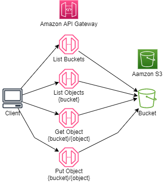

## Example
This example demonstrates how to integrate Amazon API Gateway with Amazon S3 to perform basic S3 operations. The example uses the AWS CDK to deploy an Amazon S3 bucket and an Amazon API Gateway. The gateway is already configured with API methods that will list buckets, list objects inside a bucket, get an object from a bucket and add a new object to a bucket. Inside the Jupyter Notebook directory there is a client notebook with Python scripts for testing.



## Setup

You will need to download and install [Node.js](https://nodejs.org/en/download/) before you can start using the AWS Cloud Development Kit.

This example is developed using the AWS CDK and Typescript, so you will need to install both Typescript and the CDK using the following commands
```
npm install -g typescript
npm install -g aws-cdk@latest
```
Since this CDK project uses ['Assests'](https://docs.aws.amazon.com/cdk/latest/guide/assets.html), you might need to run the following command to provision resources the AWS CDK will need to perform the deployment.

```bash
cdk bootstrap
```

The testing scripts can be executed using Jupyter Notebook. There are a few methods for installing Jupyter Notebooks. These instructions will help you get to started with [JupyterLab](https://jupyter.org/install) installation.

You can also install Jupyter Notebooks as part of [Anaconda](https://docs.anaconda.com/anaconda/install/index.html) installation.

To download this example, you will need to install [Git](https://github.com/git-guides/install-git). After installing git follow these [instructions](https://github.com/git-guides/git-clone) to learn how to clone the repository.

After the repository has been cloned set the command prompt path to the cloned directory and run the following command to install the project dependencies.

```bash
npm install
```

**cdk synth** executes the application which translates the Typescript code into an AWS CloudFormation template.

```bash
cdk synth
```

After the synth command has generated the template use the  **cdk deploy** command to deploy the template to AWS CloudFormation and build the stack. You will be prompted to confirm the deployment with y/n.

```bash
cdk deploy
```
## Test the Stack
We need to install Jest since we are using the Jest framework to test the stack. Testing the stack is optional.
```
npm install --save-dev jest @types/jest @aws-cdk/assert
```

## Run the Example
Open the Jupyter Notebook in the **jupyter_notebook directory** follow the instructions.

## Cleanup
From the command prompt execute the following command: **cdk destroy**

## Deployed Resources
|	Identifier	|	Service	|	Type	|
|	:---	|	:---	|	:---	|
ApigwS3Stack-CustomS3AutoDeleteObjectsCustomResour-Sfisq5METC1E	|	Lambda	| Function
ApigwS3Stack-CustomS3AutoDeleteObjectsCustomResour-ZMBDNMMX6314	|	IAM	| Role
apigws3stack-s3bucket07682993-1n6xocsar8neq	|	S3	| Bucket
restapis/vc64a34fx1	|	ApiGateway	| RestApi
account/ApigwS-S3Obj-Q4xsvLTyC5jX	|	ApiGateway | Account
ApigwS3Stack-S3ObjectsApiCloudWatchRole1AFD0F4C-1XRB3NL9ZQH2K	|	IAM	| Role
ApigwS3Stack-apigatewayroleE6D48DBD-V4J987JKUHKO	|	IAM	| Role
